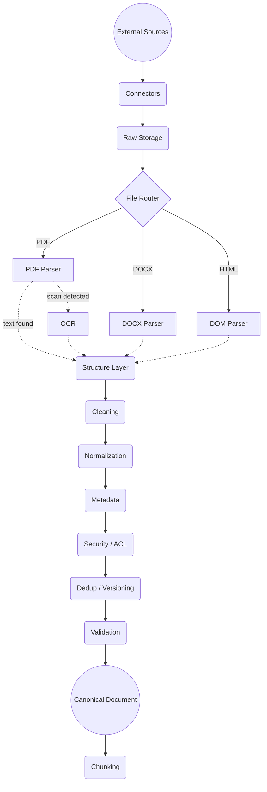

# Chapter 2 — Documents, Data Sources & Ingestion

> **Prerequisites:** [Chapter 1 — RAG Fundamentals](../01_rag_fundamentals/)
> **Next:** Chapter 3 — Document Chunking

## 60-second summary

Chapter 1 ended with `Documents → Chunk → Embed`. This chapter is **everything before that
first arrow** — and it is where most real-world RAG systems quietly fail.

> A retriever cannot retrieve information that ingestion failed to capture.

$$Q_{\text{RAG}} \approx Q_{\text{ingestion}} \times Q_{\text{retrieval}} \times Q_{\text{generation}}$$

If ingestion scores 0.4, a perfect retriever and a perfect LLM are still capped at 0.4.

## Why this chapter is split into 14 modules

The source material for this chapter is roughly 170 sections. As one notebook it was
unusable — too long to navigate, too long to re-run, and impossible to dip back into.

Each module below is self-contained and independently runnable. Work through them in
order the first time; afterwards treat them as reference.

## Modules

| # | Module | What you actually learn | Key concepts | Real documents used |
|---|---|---|---|---|
| 2a | [Why Ingestion Matters & The Canonical Document](2a_why_ingestion_and_canonical_documents/) | Why bad parsing caps every downstream metric, and how one shared schema keeps 10 source formats from becoming 10 different codebases | The quality ceiling, ingestion ≠ chunking, canonical schema, `raw_text` vs `clean_text`, connectors | GDPR (citation example) |
| 2b | [PDF Parsing](2b_pdf_parsing/) | Why PDF parsing is genuinely hard, and how to detect that your extraction is wrong before it reaches the index | PDF is not a text format, page provenance, reading order, heading detection by font weight, what `get_text()` silently misses | BERT paper, RAG paper, IRS W-4, GDPR |
| 2c | [OCR & Scanned Documents](2c_ocr_and_scanned_documents/) | How to know whether OCR output is trustworthy instead of just hoping it is | Rendering to image, real Tesseract confidence scores, three-tier routing, character confusions, cost modelling | Tesseract test scans, IRS W-4 |
| 2d | [DOCX, HTML & Markdown](2d_docx_html_markdown/) | Why these formats are easier than PDF, and how to not throw away the structure they already give you for free | Native structure extraction, heading context, boilerplate removal | Calibre demo DOCX, GDPR HTML |
| 2e | [Structured Data: CSV, JSON, DB, API](2e_structured_data_csv_json_db_api/) | When embedding a row is right, and when it is the wrong tool entirely | What is one retrievable unit, row serialization, nested JSON, when not to embed, live APIs | Titanic CSV, live GitHub/OpenAlex APIs |
| 2f | [Metadata & Provenance](2f_metadata_and_provenance/) | Why metadata decides whether retrieval is precise or just plausible-sounding | Six metadata categories, filtering precision, deterministic vs LLM extraction, citation chains | GDPR |
| 2g | [Cleaning & Normalization](2g_cleaning_and_normalization/) | How to remove genuine noise without deleting real content by accident | Whitespace, line wrap, hyphenation, Unicode, header/footer detection on real pages, the over-cleaning trap | GDPR |
| 2h | [Deduplication & Versioning](2h_deduplication_and_versioning/) | Why exact-match hashing is not enough, and how versioning avoids indexing two contradictory "truths" | SHA-256, Jaccard similarity, MinHash/LSH at scale, effective vs publication date, amendments | GDPR PDF vs HTML |
| 2i | [Incremental Ingestion](2i_incremental_ingestion/) | How to re-index only what changed instead of reprocessing everything every time | Change detection, deletion handling, stable IDs, idempotency, atomic replacement | Corpus checksums |
| 2j | [Tables, Images & Special Formats](2j_tables_images_special_formats/) | Why naive table serialization breaks numeric reasoning, and how other formats each need their own strategy | Table serialization, figures, PowerPoint, Excel, email, code, legal documents | IRS W-4 tables, Calibre DOCX tables |
| 2k | [Security & Access Control](2k_security_and_access_control/) | Why access control has to happen at ingestion time, not as a prompt instruction | Permissions travel with the document, ACL inheritance, PII handling | — |
| 2l | [Production Architecture](2l_production_architecture/) | How ingestion actually runs at scale: queues, retries, and what happens when a document fails | Three-layer storage, batch vs event-driven, backpressure, retries, dead-letter queues, cost | — |
| 2m | [Validation & Observability](2m_validation_and_observability/) | How to catch a broken parser before it silently corrupts your entire index | Pre-chunking validation, anomaly detection, metrics, golden document sets, parser benchmarking | Full corpus |
| 2n | [End-to-End Pipeline](2n_end_to_end_pipeline/) | Putting every module together into one working system, and how to debug it when something goes wrong | Anti-patterns, the debugging ladder, interview preparation | Full corpus |

## Real documents, not dummy ones

Every example in this chapter runs on real public documents, fetched and cached by
[`utils/corpus.py`](../utils/corpus.py). Each was chosen because it demonstrates a specific
failure mode that a hand-made file cannot.

```python
from utils.corpus import describe, fetch
describe()                 # see the catalogue and what each document teaches
path = fetch("gdpr_pdf")   # downloads once, cached thereafter
```

| Document | Source | Licence | Why it is here |
|---|---|---|---|
| GDPR (88 pp) | EUR-Lex | EU reuse-permitted | Real repeated headers on 88/88 pages; `Article N(n)(a)` citations; headings marked by weight, not size |
| BERT paper | arXiv 1810.04805 | arXiv distribution licence | Genuinely two-column layout — the reading-order problem, reproducible on a real document |
| RAG paper | arXiv 2005.11401 | arXiv distribution licence | Single-column — the control case that breaks a naive column splitter that assumes every paper is two-column |
| IRS Form W-4 | irs.gov | US government, public domain | 48 AcroForm fields that `get_text()` never returns |
| Calibre demo DOCX | calibre-ebook.com | GPL | Real Heading 1/2 hierarchy, 5 tables, table of contents, footnotes |
| Tesseract scans | tesseract-ocr/test | Apache-2.0 | Real OCR confidence scores, including multilingual degradation |
| Titanic CSV | datasciencedojo | Public dataset | 891 real rows with genuine missing values |

The corpus is git-ignored — you download it locally, you do not redistribute it.

## Things the real documents revealed

These are findings from actually running the code, not hypotheticals.

| Finding | Why it matters |
|---|---|
| The RAG paper is single-column, despite being an arXiv NLP paper | A naive "academic paper implies two columns" assumption shreds a document that has no columns at all |
| GDPR headings are 9.6pt — identical to body text | A size-based heading detector finds zero headings; detecting font weight instead recovers the real Article headings |
| The IRS W-4 hides 48 form fields | Text extraction reports a confident 26,092 characters while silently omitting every field value |
| A naive frequency filter flags `'3.'` on 49/88 GDPR pages | Those are list numbers, not boilerplate — a real false positive from a plausible-looking heuristic |
| OCR round-trip recall is 97% on a real form | The 3% error is plausible-looking near-misses, not garbage — which is exactly what makes OCR errors dangerous |

## The 12 key principles

| # | Principle |
|---|---|
| 1 | Garbage in, garbage out — RAG quality begins with data quality |
| 2 | PDF extraction is not trivial text reading |
| 3 | Preserve structure: headings, sections, tables, pages, figures |
| 4 | Keep metadata |
| 5 | Keep provenance |
| 6 | Carry ACL/security metadata during ingestion, not after |
| 7 | Maintain stable document IDs — never a fresh `uuid4()` per run |
| 8 | Deduplicate documents |
| 9 | Handle versions, updates, and deletions |
| 10 | Keep original/raw content where feasible |
| 11 | Use incremental rather than complete re-indexing |
| 12 | Do not flatten valuable structure before chunking |

## Key formulas

| Formula | Meaning | Module |
|---|---|---|
| $Q_{\text{RAG}} \approx Q_{\text{ing}} \times Q_{\text{ret}} \times Q_{\text{gen}}$ | Ingestion quality caps everything downstream | 2a |
| $C_{\text{page}} = \frac{1}{N}\sum c_i$ | Average OCR confidence across a page's words | 2c |
| $f(l) = \frac{\#\text{pages containing } l}{N}$ | Boilerplate detection frequency across pages | 2g |
| $J(A,B) = \frac{\lvert A \cap B\rvert}{\lvert A \cup B\rvert}$ | Jaccard similarity for near-duplicate detection | 2h |
| $O(N^2)$ | Why naive pairwise deduplication fails at scale | 2h |
| $f(f(x)) = f(x)$ | Idempotency — re-running ingestion must not duplicate data | 2i |
| $\text{delay}_n = \min(d_{\max}, d_0 \cdot 2^n)$ | Exponential backoff for retrying failed fetches | 2l |
| $L = T_{\text{indexed}} - T_{\text{source}}$ | Freshness lag versus the ingestion SLA | 2m |
| $R_\alpha = N_\alpha / N$ | Alphabetic ratio as a corruption signal in extracted text | 2m |

## The architecture to remember



### Three-layer storage

| Layer | Holds | Why it exists |
|---|---|---|
| Raw | Original source files exactly as fetched | Re-run parsing without re-downloading, if a parser bug is found |
| Canonical | Text, layout, tables, metadata, provenance | Re-run chunking without re-parsing, if the chunking strategy changes |
| Retrieval index | Chunks, embeddings, BM25 index, metadata filters | The only layer the online query pipeline actually touches |

## Setup

```bash
pip install -r ../requirements.txt

# For module 2c only - OCR needs a binary as well as the Python package:
brew install tesseract          # macOS
sudo apt install tesseract-ocr  # Ubuntu
```

No API key needed for this chapter — it is entirely local parsing and text processing.
Every module guards on optional dependencies and skips gracefully.

First run downloads roughly 5 MB of real documents into `../assets/real_corpus/`
(git-ignored, cached thereafter).

## The interview answer

> I separate ingestion into connectors, raw storage, parser routing, structure extraction,
> cleaning and normalization, metadata and ACL enrichment, deduplication/versioning,
> validation, and canonical storage. PDFs may require digital-text extraction or OCR/layout
> parsing depending on their type. I preserve provenance and structural information such as
> sections, pages, tables, and headings because downstream chunking and citations depend on
> it. The pipeline should be incremental, idempotent, observable, retryable, and capable of
> propagating updates and deletions into the retrieval index.
