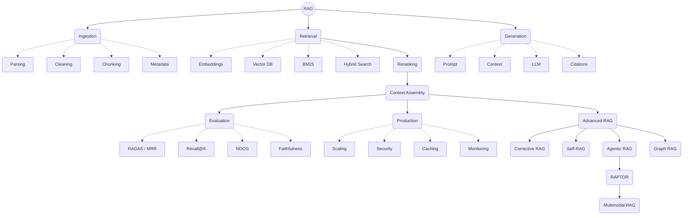

# RAG — Theory + Practice

A hands-on course on **Retrieval-Augmented Generation**, built from a FAANG-interview-oriented
syllabus. Every chapter is one self-contained Jupyter notebook that pairs the theory
(as markdown) with clean, heavily-commented Python you can run and modify.

**Format of every notebook** — intuition → theory → maths → diagrams → each technique
implemented *separately* in Python (comment above every meaningful line) → trade-offs →
production considerations → interview questions.

**Naming convention:** each chapter folder is named `NN. Title Case Name`, and the
notebook inside shares that same name. The two-digit prefix keeps chapters in order in
both the file browser and on GitHub.

## Setup (one time)

```bash
# 1. Create and activate a virtual environment
python3 -m venv .venv
source .venv/bin/activate          # Windows: .venv\Scripts\activate

# 2. Install dependencies
pip install -r requirements.txt

# 3. Add your API credentials
cp .env.example .env
# then open .env and paste your Azure OpenAI / OpenAI credentials

# 4. Launch Jupyter
jupyter lab                        # or: jupyter notebook
```

Models used throughout (configurable in `.env`):

| Purpose | Default model | Why this one |
|---|---|---|
| Embeddings | `text-embedding-3-small` | 1536 dimensions, cheap enough to embed everything without worrying about cost |
| Generation | `gpt-4o-mini` | Fast, cheap, strong enough to expose RAG failure modes clearly (a smarter model can paper over a bad retriever) |

Cost note: the whole course costs well under a dollar in API calls. Embedding a few
dozen toy sentences is fractions of a cent.

## Course roadmap

### Part I — Foundations

| # | Chapter | What you actually learn | Status |
|---|---|---|---|
| 01 | [RAG Fundamentals](01.%20Rag%20fundamentals/) | What RAG is and isn't, the two pipelines, cosine similarity from scratch, a naive RAG system built with no framework, the retrieval-vs-generation debugging split | Done |
| 02 | [Documents, Data Sources & Ingestion](02.%20Documents%20data%20sources%20ingestion/) | Why ingestion caps everything downstream, real PDF/OCR/DOCX parsing on real documents, metadata, dedup, security, production ingestion architecture | Done (2a-2c of 14 modules) |
| 03 | Document Chunking | Why chunk size and overlap decide retrieval quality more than any other single choice; fixed, semantic, recursive, and structure-aware chunking | Planned |
| 04 | Tokens & Tokenization | BPE/WordPiece/SentencePiece, token-budget math, how tokenization silently breaks retrieval on non-English text | Planned |
| 05 | Embeddings Fundamentals | Dense vectors, model selection, domain-specific and multilingual embeddings | Planned |
| 06 | Embedding Mathematics | Vector spaces, distance metrics, the curse of dimensionality | Planned |

### Part II — Storage & Search

| # | Chapter | What you actually learn | Status |
|---|---|---|---|
| 07 | Vector Databases | FAISS, Milvus, Pinecone, Qdrant, pgvector — when each one fits | Planned |
| 08 | Approximate Nearest Neighbor Search | HNSW, IVF, product quantization, the recall-vs-latency tradeoff | Planned |
| 09 | Sparse Retrieval / Keyword Search | TF-IDF, BM25 derived from first principles, inverted indexes | Planned |
| 10 | Dense Retrieval | Bi-encoders, Dense Passage Retrieval, why dense alone misses exact matches | Planned |
| 11 | Hybrid Search | Reciprocal Rank Fusion, when hybrid beats pure vector search | Planned |
| 12 | Metadata & Filtered Retrieval | Pre- vs post-filtering, self-query retrieval, access-control filters | Planned |

### Part III — Query & Retrieval Quality

| # | Chapter | What you actually learn | Status |
|---|---|---|---|
| 13 | Query Processing | Spell correction, intent detection, entity extraction before retrieval | Planned |
| 14 | Query Transformation | HyDE, Query2Doc, step-back prompting, multi-query retrieval | Planned |
| 15 | Retrieval Strategies | MMR, parent-document retrieval, ensemble retrievers | Planned |
| 16 | Reranking | Cross-encoders vs bi-encoders, why "similar" isn't "relevant" | Planned |
| 17 | Context Construction | The lost-in-the-middle problem, deduplication, ordering retrieved chunks | Planned |
| 18 | Contextual Compression | Extractive vs LLM-based compression under a token budget | Planned |

### Part IV — Generation

| # | Chapter | What you actually learn | Status |
|---|---|---|---|
| 19 | Prompt Engineering for RAG | Grounding instructions, citation prompting, handling insufficient evidence | Planned |
| 20 | Generation Layer | Temperature, faithfulness, structured and citation-backed output | Planned |
| 21 | Conversational RAG | History-aware retrieval, short vs long-term memory, token-efficient history | Planned |

### Part V — Advanced Architectures

| # | Chapter | What you actually learn | Status |
|---|---|---|---|
| 22 | Advanced RAG Architectures | Naive vs advanced vs modular RAG, where each variant earns its complexity | Planned |
| 23 | Corrective RAG (CRAG) | Relevance grading and web-search fallback when retrieval confidence is low | Planned |
| 24 | Self-RAG | Reflection tokens: the model checking its own retrieval and output | Planned |
| 25 | Adaptive RAG | Routing simple vs complex queries to different retrieval strategies | Planned |
| 26 | Agentic RAG | Tool-calling retrievers, multi-hop reasoning, retry loops with LangGraph | Planned |
| 27 | Graph RAG | Knowledge graphs, community detection, local vs global search | Planned |
| 28 | Multi-Hop RAG | Query decomposition and evidence chaining across documents | Planned |
| 29 | RAPTOR | Recursive summarization trees for hierarchical retrieval | Planned |
| 30 | Multimodal RAG | Text + images, CLIP-style embeddings, vision-language retrieval | Planned |
| 31 | Table RAG | Why serialization alone fails on numeric tables, and what to do instead | Planned |
| 32 | Text-to-SQL + RAG | Schema retrieval, SQL generation, grounding results back to natural language | Planned |
| 33 | Knowledge Graph + RAG | Entity linking, Cypher/SPARQL, hybrid vector + graph retrieval | Planned |

### Part VI — Evaluation

| # | Chapter | What you actually learn | Status |
|---|---|---|---|
| 34 | RAG Evaluation Fundamentals | Why evaluating RAG is genuinely hard; offline vs online evaluation | Planned |
| 35 | Retrieval Metrics | Precision@K, Recall@K, MRR, NDCG derived and computed by hand | Planned |
| 36 | Generation Metrics | Faithfulness, groundedness, hallucination rate | Planned |
| 37 | RAG Evaluation Frameworks | RAGAS, DeepEval, TruLens, LLM-as-a-judge | Planned |
| 38 | Synthetic Evaluation Datasets | Generating ground truth, hard negatives, evaluation-set design | Planned |
| 39 | Failure Analysis | Attributing a wrong answer to ingestion, retrieval, or generation | Planned |

### Part VII — Production

| # | Chapter | What you actually learn | Status |
|---|---|---|---|
| 40 | RAG Optimization | Systematically tuning chunk size, top-K, thresholds, and prompts | Planned |
| 41 | RAG Latency & Performance | Where time actually goes in a RAG request, and how to cut it | Planned |
| 42 | Caching in RAG | Embedding, retrieval, and semantic caches with Redis | Planned |
| 43 | Production RAG Architecture | API layer, ingestion workers, retriever service, LLM gateway | Planned |
| 44 | Incremental Indexing | Re-embedding only what changed, deduplication at scale | Planned |
| 45 | Security & Access-Control RAG | RBAC/ABAC, tenant isolation, why prompts aren't a security boundary | Planned |
| 46 | Multi-Tenant RAG | Shared vs isolated indexes, namespace design, cost tradeoffs | Planned |
| 47 | RAG Guardrails | Prompt injection detection, output validation, grounding checks | Planned |
| 48 | Observability & Monitoring | Tracing retrieval, tracking hallucination rate in production | Planned |
| 49 | Feedback Loops | Turning thumbs-down signals into hard negatives and better retrieval | Planned |
| 50 | RAG Cost Optimization | Model routing, small-vs-large-model strategy, where the money actually goes | Planned |

### Part VIII — Frameworks & Interviews

| # | Chapter | What you actually learn | Status |
|---|---|---|---|
| 51 | RAG Frameworks | LangChain, LangGraph, LlamaIndex, Haystack — and when to skip all of them | Planned |
| 52 | Building RAG From Scratch in Python | The entire pipeline with zero frameworks, one more time, end to end | Planned |
| 53 | Production RAG System Design | Designing for 100M chunks and thousands of concurrent users | Planned |
| 54 | RAG Interview Case Studies | Legal, healthcare, financial, and codebase RAG worked examples | Planned |
| 55 | FAANG RAG Interview Questions & System Design | The questions interviewers actually ask, with model answers | Planned |

## The whole curriculum as one flow


